# S-DES 加密解密工具

## 1. 用户指南

### 1.1 软件概述
S-DES加密解密工具是一个基于简化版DES算法的图形化应用程序，支持ASCII文本和二进制数据的加密解密操作，并提供暴力破解功能。

### 1.2 系统要求
- **操作系统**: Windows 7/10/11, Linux, macOS
- **开发环境**: Qt 5.12 或更高版本
- **编译器**: 支持C++11标准的编译器

### 1.3 安装说明
1. 确保系统已安装Qt开发环境。
2. 下载源代码文件 (`sdes.h`, `sdes.cpp`, `main.cpp`)。
3. 使用Qt Creator打开项目文件 `SDesCryptography.pro`。
4. 编译并运行程序。

### 1.4 使用说明

#### 1.4.1 加解密功能
1.  **选择输入模式**:
    *   **ASCII文本**: 直接输入文本字符。
    *   **二进制**: 输入8位倍数的二进制字符串。
2.  **选择显示模式**:
    *   **十六进制**: 以十六进制格式显示结果。
    *   **原始字节**: 直接显示加密后的字节。
3.  **操作步骤**:
    *   在明文框中输入待加密内容。
    *   在密钥框中输入10位二进制密钥。
    *   点击"加密"按钮进行加密。
    *   点击"解密"按钮进行解密。

#### 1.4.2 暴力破解功能（ASCII输入输出）
1. 在"已知明文"和"已知密文"框中输入明密文对。
2. 选择是否使用多线程加速。
3. 点击"开始暴力破解"按钮。
4. 查看破解结果和耗时。

## 2. 开发手册

### 2.1 代码结构
```
.
├── SDesCryptography.pro
├── main.cpp
├── sdes.cpp
└── sdes.h
```

### 2.2 核心类说明

#### 2.2.1 `BruteforceThread` 类
负责暴力破解的多线程实现。
- **关键方法**:
  - `run()`: 线程执行函数。
  - `encryptString()`: 字符串加密。
  - `decryptString()`: 字符串解密。

#### 2.2.2 `SDes` 类
主窗口类，负责UI和算法调度。
- **关键方法**:
  - `encryptChar()`: 单字符加密。
  - `decryptChar()`: 单字符解密。
  - `setupUI()`: 界面初始化。

### 2.3 接口文档

#### 2.3.1 加密解密接口
```cpp
// 单字符加密
char encryptChar(char plaintext, const std::string& key);

// 单字符解密  
char decryptChar(char ciphertext, const std::string& key);

// 字符串加密
std::string encryptString(const std::string& plaintext, const std::string& key);

// 字符串解密
std::string decryptString(const std::string& ciphertext, const std::string& key);
```

#### 2.3.2 工具函数接口
```cpp
// 二进制与字符串转换
std::string stringToBinary(const std::string& str);
std::string binaryToString(const std::string& binary);

// 十六进制与字符串转换
std::string stringToHex(const std::string& input);
std::string hexToString(const std::string& hex);

// 输入验证
bool isValidBinaryKey(const std::string& key);
bool isValidBinaryInput(const std::string& input);
```


## 3.过关情况
### 3.1 第1关：基本测试
根据S-DES算法编写和调试程序，提供GUI解密支持用户交互。输入可以是8bit的数据和10bit的密钥，输出是8bit的密文。
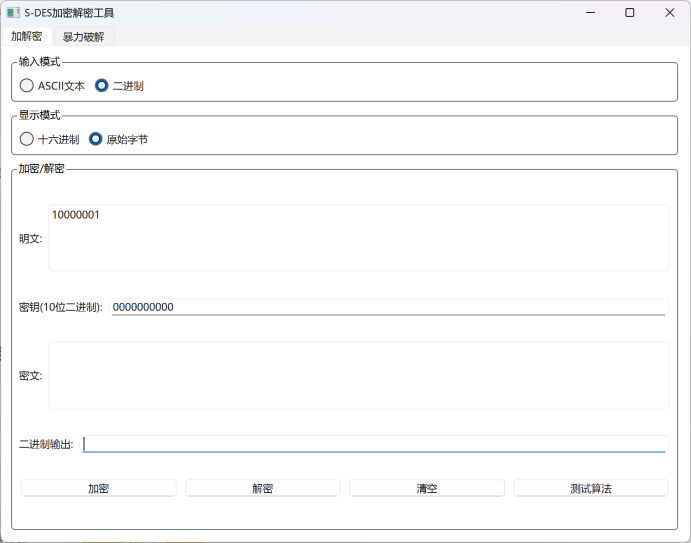
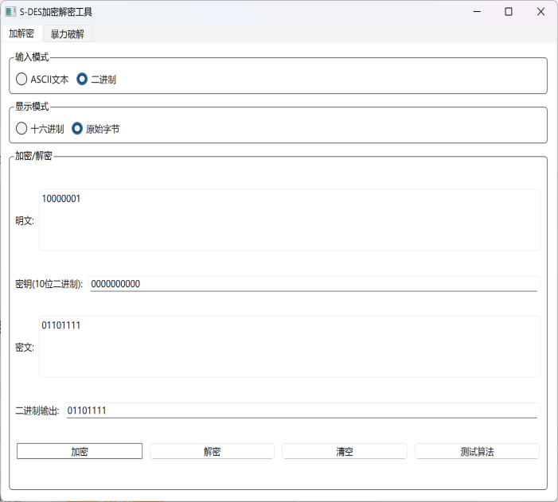
### 3.2 第2关：交叉测试
考虑到是算法标准，所有人在编写程序的时候需要使用相同算法流程和转换单元(P-Box、S-Box等)，以保证算法和程序在异构的系统或平台上都可以正常运行。
设有A和B两组位同学(选择相同的密钥K)；则A、B组同学编写的程序对明文P进行加密得到相同的密文C；或者B组同学接收到A组程序加密的密文C，使用B组程序进行解密可得到与A相同的P。
别人的明文10000001，密钥0000000000，加密后的01101111在我的程序上解密为10000001
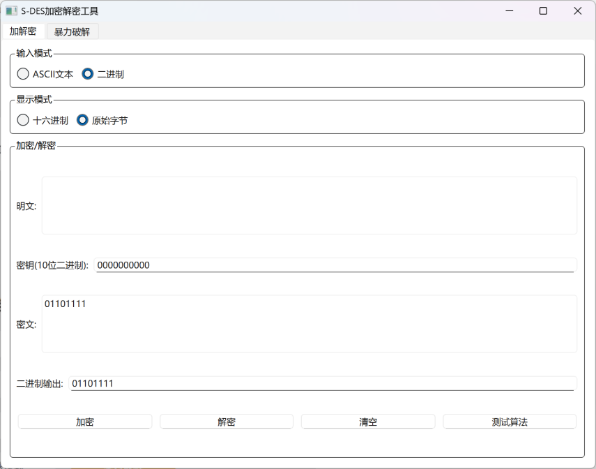
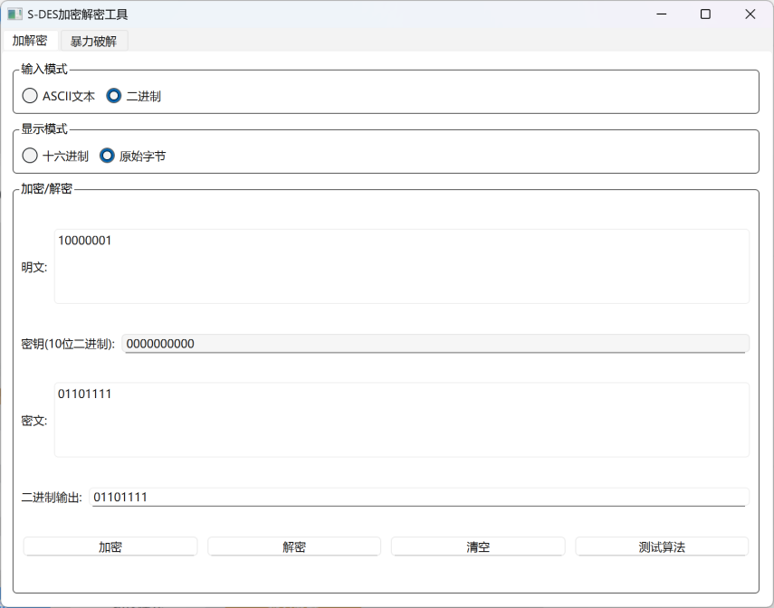
  
### 3.3 第3关：扩展功能
考虑到向实用性扩展，加密算法的数据输入可以是ASII编码字符串(分组为1 Byte)，对应地输出也可以是ACII字符串(很可能是乱码)。
   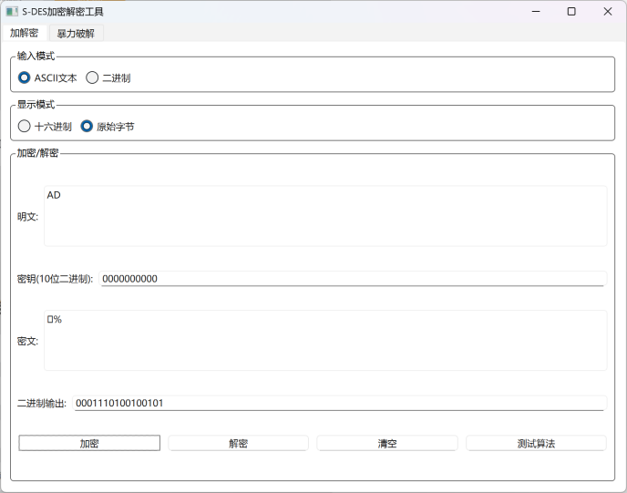
   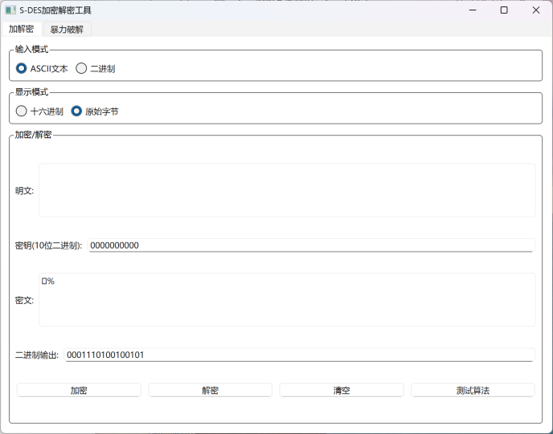
   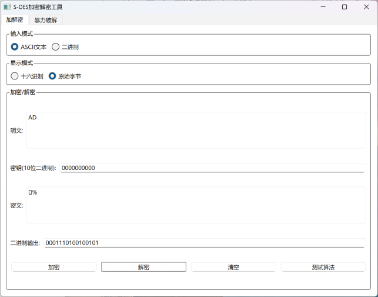
### 3.4 第4关：暴力破解
假设你找到了使用相同密钥的明、密文对(一个或多个)，请尝试使用暴力破解的方法找到正确的密钥Key。在编写程序时，你也可以考虑使用多线程的方式提升破解的效率。请设定时间戳，用视频或动图展示你在多长时间内完成了暴力破解。
   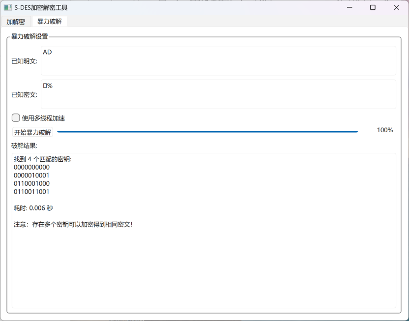
   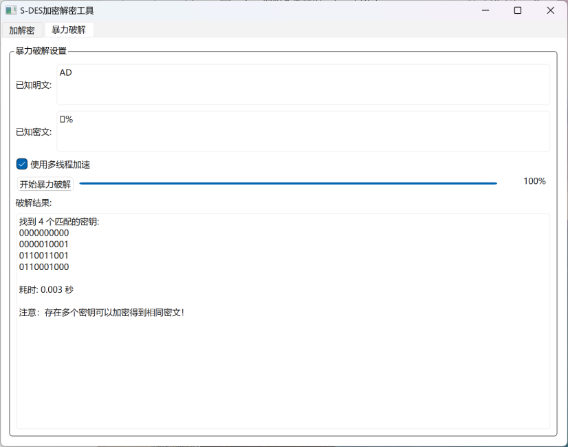
   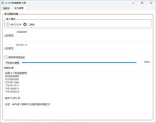
   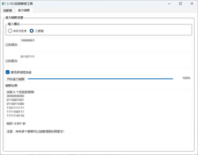
### 3.5 第5关：封闭测试
根据第4关的结果，进一步分析，对于你随机选择的一个明密文对，是不是有不止一个密钥Key？进一步扩展，对应明文空间任意给定的明文分组P_{n}，是否会出现选择不同的密钥K_{i}\ne K_{j}加密得到相同密文C_n的情况？
存在不同的密钥加密得到相同密文
    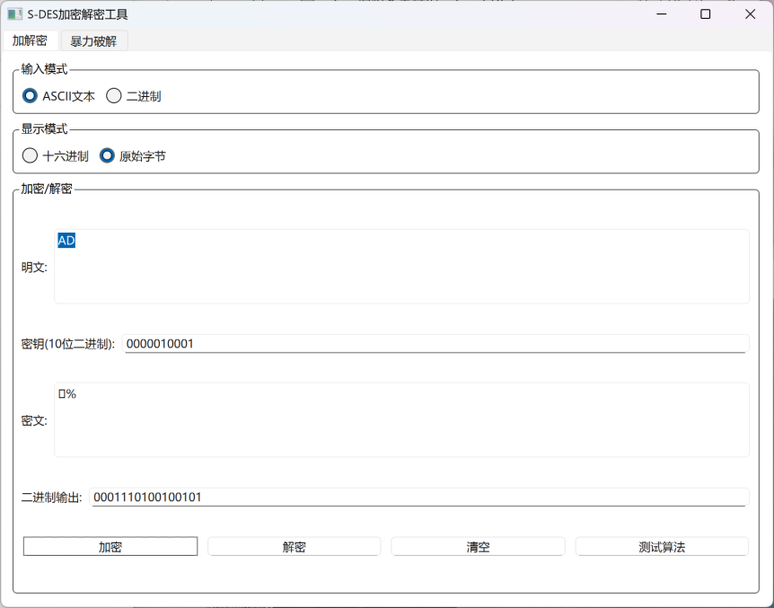
    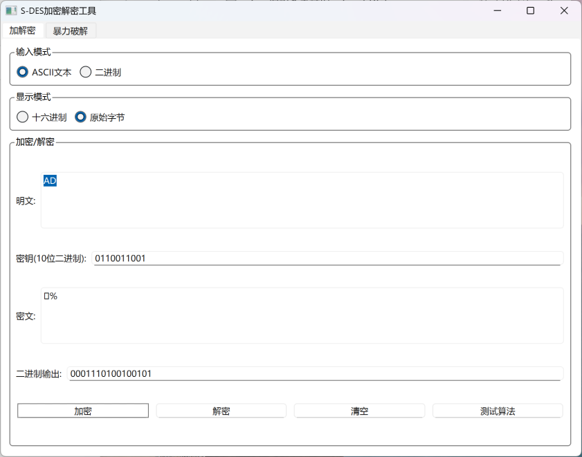
    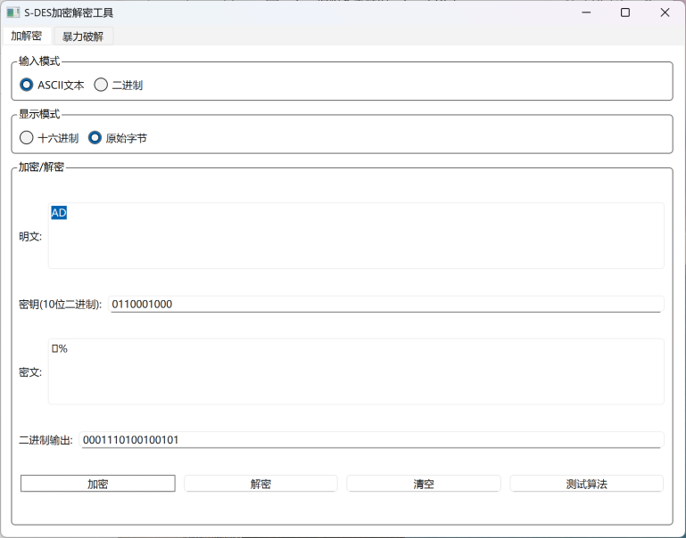
    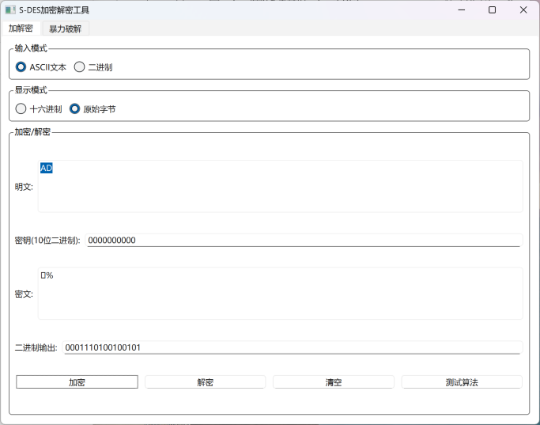
